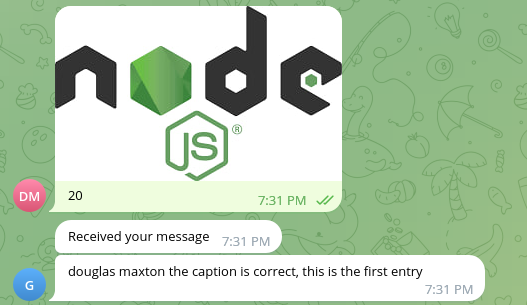
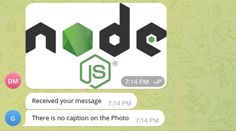
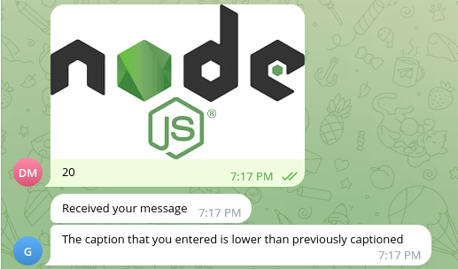
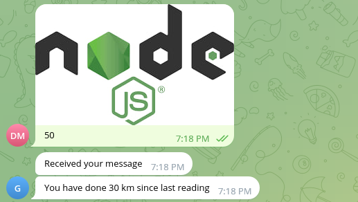
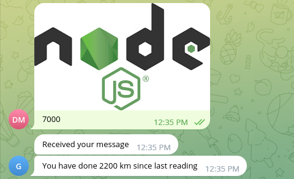
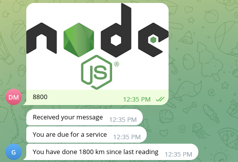
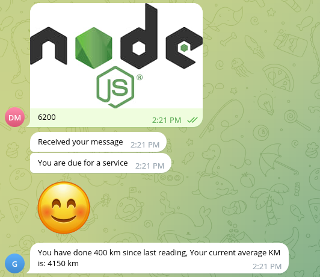

<h1 style="color: turquoise">This is a Telegram Bot</h1>

<h2>Description</h2>
<ul>
    <li>This project was started to communicate with telegram based on what photos you send to it</li>
    <li>You take pictures of the kilometers of your vehicle, followed by the caption saying how many kilometers was done</li>
    <li>Once photo is sent on Telegram it runs some logic then sends a response back</li>
</ul>

<h2>Tech Stack</h2>
<ul>
    <li>JavaScript</li>
    <li>Express</li>
    <li>MongoDB (for database, at time of testing this was only done locally)</li>
    <li>Github (for version control)</li>
    <li>Intellij IDE</li>
    <li>Heroku (this is still to come)</li>
    <li>Webhooks (this will come once deployed on Heroku)</li>
</ul>

<h2>Screenshot of the bot in action</h2>

<h4>Just a simple response with a message</h4>

 

<h4>If this is the first entry to the bot</h4>

<h4>If you don't attach a caption to photo</h4>

<h4>If the caption is lower than previously captioned</h4>

<h4>If the caption is higher than previously captioned</h4>

<h2>Screenshot of when servicing is due</h2>

<h4>If no service is Due</h4>

<h4>If a service is due it will send you a reminder</h4>

The service works at a range of 300 below and 300 above the next service

<h2>Emoji</h2>

<h4>If all data is correctly received and stored it sends a smiley face emoji to Telegram</h4>

<h2>What will be the next step for this project?</h2>

<ul>
    <li>This project needs to be made live on Heroku</li>
    <li>Once live setup Webhooks</li>
    <li>Test it with taken photos of vehicle KM (this can only be done when I obtain a vehicle)</li>
    <li>If the step above can be completed, then test to see if numbers can be grabbed from photos</li>
</ul>

<h4>NOTE: This is not based on KM taken from bike, as of when this was done I didn't have a vehicle to test it with</h4>